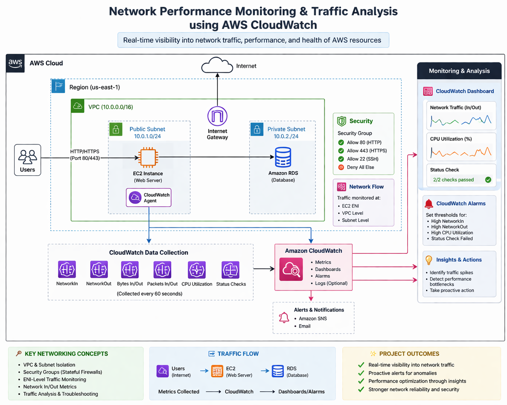

## 📌 Project Overview

Designed and implemented a network monitoring solution within an AWS Virtual Private Cloud (VPC) to analyze traffic patterns, detect anomalies, and improve infrastructure visibility using Amazon CloudWatch.

This project focuses on real-time monitoring of network performance metrics (NetworkIn/NetworkOut) and system behavior to simulate a Network Operations Center (NOC) environment.

---

## 🎯 Problem Statement

Modern cloud-based systems require continuous monitoring of network traffic to ensure performance, reliability, and security. Without proper visibility, abnormal traffic spikes, potential attacks, or misconfigurations may go undetected, leading to downtime or security risks.

---

## 💡 Solution

Implemented a monitoring architecture leveraging AWS CloudWatch to:

* Track real-time network traffic metrics
* Visualize infrastructure performance using dashboards
* Detect anomalies through alarms
* Enable proactive troubleshooting of network-related issues

---

## 🧱 Architecture Overview

### Components:

* Amazon EC2 Instance (t2.micro)
* Virtual Private Cloud (VPC)
* Public Subnet
* Internet Gateway (IGW)
* Security Groups (Firewall rules)
* Amazon CloudWatch (Monitoring & Alerting)

### Network Flow:

User Traffic → Internet Gateway → EC2 Instance → CloudWatch Metrics Collection

---

## 🔑 Key Networking Concepts Demonstrated

* **Network Traffic Monitoring:** Analysis of inbound and outbound traffic (NetworkIn/NetworkOut)
* **Subnetting & IP Addressing:** Deployment within a structured VPC network
* **Firewall Configuration:** Security Groups controlling inbound/outbound traffic
* **Stateful Packet Filtering:** Allowing only required ports (SSH, HTTP)
* **Traffic Analysis:** Correlating network usage with system performance
* **Network Visibility:** Real-time dashboards for operational insight

---

## ⚙️ Implementation Steps

### 1. VPC & Networking Setup

* Created a custom VPC with defined CIDR block
* Configured a public subnet
* Attached an Internet Gateway
* Updated route tables for internet access

### 2. EC2 Instance Deployment

* Launched a t2.micro instance
* Enabled SSH (port 22) and HTTP (port 80)
* Associated with configured security group

### 3. CloudWatch Metrics Monitoring

* Enabled EC2 detailed monitoring
* Tracked key metrics:

  * NetworkIn
  * NetworkOut
  * CPUUtilization

### 4. Dashboard Creation

* Built a CloudWatch dashboard with widgets for:

  * Network traffic visualization
  * CPU usage correlation

### 5. Alarm Configuration

* Configured alarms for:

  * High NetworkIn traffic
  * High CPU utilization
* Enabled notifications for threshold breaches

---

## 📊 Traffic Simulation & Analysis

To validate monitoring effectiveness:

* Generated HTTP traffic to the EC2 instance
* Observed corresponding spikes in NetworkIn/NetworkOut metrics
* Correlated increased CPU utilization with traffic load

---
## Architecture Diagram

### Key Observation:

Traffic spikes directly impacted system performance, demonstrating the importance of continuous monitoring and alerting.

---

## 🧠 Design Decisions

* **Used CloudWatch over third-party tools** for native AWS integration and scalability
* **Enabled only required ports** to minimize attack surface
* **Focused on key metrics (NetworkIn/Out)** to simulate real-world network monitoring scenarios

---

## 🚨 Challenges & Troubleshooting

| Issue                 | Cause                           | Resolution                                  |
| --------------------- | ------------------------------- | ------------------------------------------- |
| No traffic observed   | Security group misconfiguration | Updated inbound rules to allow HTTP traffic |
| No metrics visibility | Monitoring delay                | Enabled detailed monitoring                 |
| No alerts triggered   | Incorrect thresholds            | Adjusted alarm thresholds                   |

---

## 📈 Results & Impact

* Achieved real-time visibility into network traffic patterns
* Successfully detected abnormal traffic spikes using alarms
* Demonstrated ability to correlate network activity with system performance
* Built a monitoring solution aligned with real-world NOC operations

---

## 🔐 Security Considerations

* Restricted access using security groups
* Allowed only necessary ports (22, 80)
* Prevented unnecessary exposure of services

---

## 🚀 Future Improvements

* Integrate VPC Flow Logs for deeper packet-level analysis
* Implement automated scaling based on traffic patterns
* Add intrusion detection mechanisms
* Extend monitoring to multi-instance environments

---

## 📚 Skills Demonstrated

* Network Monitoring & Traffic Analysis
* AWS CloudWatch (Dashboards & Alarms)
* VPC Networking & Subnet Design
* Firewall Configuration (Security Groups)
* Troubleshooting & Performance Analysis

---

## 🏁 Conclusion

This project demonstrates the ability to monitor, analyze, and respond to network performance within a cloud environment. It highlights practical networking skills combined with cloud-native monitoring tools, showcasing readiness for real-world infrastructure and network operations roles.

---

## Good move—adding **official documentation links** makes your project instantly look more credible and professional.

Here are **well-selected, recruiter-relevant links** you can paste directly into your README 👇

---

# 📚 **References & Documentation**

## ☁️ AWS Core Networking

* Amazon Web Services VPC Documentation
  [https://docs.aws.amazon.com/vpc/latest/userguide/what-is-amazon-vpc.html](https://docs.aws.amazon.com/vpc/latest/userguide/what-is-amazon-vpc.html)

* VPC Subnets
  [https://docs.aws.amazon.com/vpc/latest/userguide/configure-subnets.html](https://docs.aws.amazon.com/vpc/latest/userguide/configure-subnets.html)

* Internet Gateway
  [https://docs.aws.amazon.com/vpc/latest/userguide/VPC_Internet_Gateway.html](https://docs.aws.amazon.com/vpc/latest/userguide/VPC_Internet_Gateway.html)

---

## 📊 Monitoring & Observability

* Amazon CloudWatch Overview
  [https://docs.aws.amazon.com/AmazonCloudWatch/latest/monitoring/WhatIsCloudWatch.html](https://docs.aws.amazon.com/AmazonCloudWatch/latest/monitoring/WhatIsCloudWatch.html)

* CloudWatch Metrics (NetworkIn/NetworkOut)
  [https://docs.aws.amazon.com/AWSEC2/latest/UserGuide/viewing_metrics_with_cloudwatch.html](https://docs.aws.amazon.com/AWSEC2/latest/UserGuide/viewing_metrics_with_cloudwatch.html)

* CloudWatch Dashboards
  [https://docs.aws.amazon.com/AmazonCloudWatch/latest/monitoring/CloudWatch_Dashboards.html](https://docs.aws.amazon.com/AmazonCloudWatch/latest/monitoring/CloudWatch_Dashboards.html)

* CloudWatch Alarms
  [https://docs.aws.amazon.com/AmazonCloudWatch/latest/monitoring/AlarmThatSendsEmail.html](https://docs.aws.amazon.com/AmazonCloudWatch/latest/monitoring/AlarmThatSendsEmail.html)

---

## 🖥 EC2 & Networking Behavior

* Amazon EC2 Networking
  [https://docs.aws.amazon.com/AWSEC2/latest/UserGuide/ec2-networking.html](https://docs.aws.amazon.com/AWSEC2/latest/UserGuide/ec2-networking.html)

* EC2 Security Groups (Firewall Rules)
  [https://docs.aws.amazon.com/AWSEC2/latest/UserGuide/ec2-security-groups.html](https://docs.aws.amazon.com/AWSEC2/latest/UserGuide/ec2-security-groups.html)

---

## 🔐 Network Security Concepts

* Security Best Practices for VPC
  [https://docs.aws.amazon.com/vpc/latest/userguide/vpc-security-best-practices.html](https://docs.aws.amazon.com/vpc/latest/userguide/vpc-security-best-practices.html)

* AWS Shared Responsibility Model
  [https://docs.aws.amazon.com/whitepapers/latest/shared-responsibility-model/welcome.html](https://docs.aws.amazon.com/whitepapers/latest/shared-responsibility-model/welcome.html)
