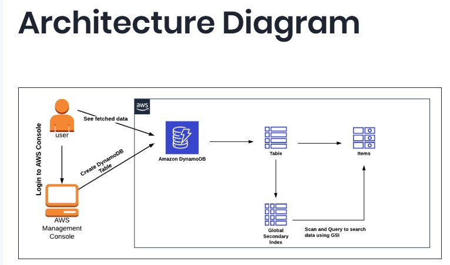

# Smart Road Accident Monitoring System with DynamoDB

## Overview

This project demonstrates how to design a real-time road accident monitoring system using Amazon DynamoDB.

It focuses on how cloud-native databases can be used to:

- store accident reports at scale
- enable fast querying using Global Secondary Indexes (GSI)
- support real-time decision-making for emergency responders

## Problem Statement

Road accidents remain a major public safety issue, especially in developing countries.

Emergency responders often face delays due to:

- fragmented reporting systems
- lack of real-time data access
- slow querying of incident records

This project explores how a scalable NoSQL database can solve this problem.

## Architecture

👉 [Detailed Architecture Explanation](./architecture/architecture-explanation.md)

## Implementation

Step-by-step guide:

- [Setup Steps](./implementation/setup-steps.md)
- [AWS CLI Commands](./implementation/aws-cli-commands.md)

## Database Design

👉 [DynamoDB Schema Design](./database-design/dynamodb-schema.md)

## Security Analysis

👉 [Security Benefits](./security-analysis/security-benefits.md)

## Real-World Use Case

👉 [Scenario Explanation](./use-case/real-world-scenario.md)

## Screenshots

- DynamoDB Table
- GSI Configuration
- Query Results

## Key AWS Services Used

- Amazon DynamoDB
- IAM

## Key Learnings

- NoSQL database design for real-time systems
- Importance of indexing (GSI)
- Designing for scalability and performance

## Author

Emmanuel Essien  
